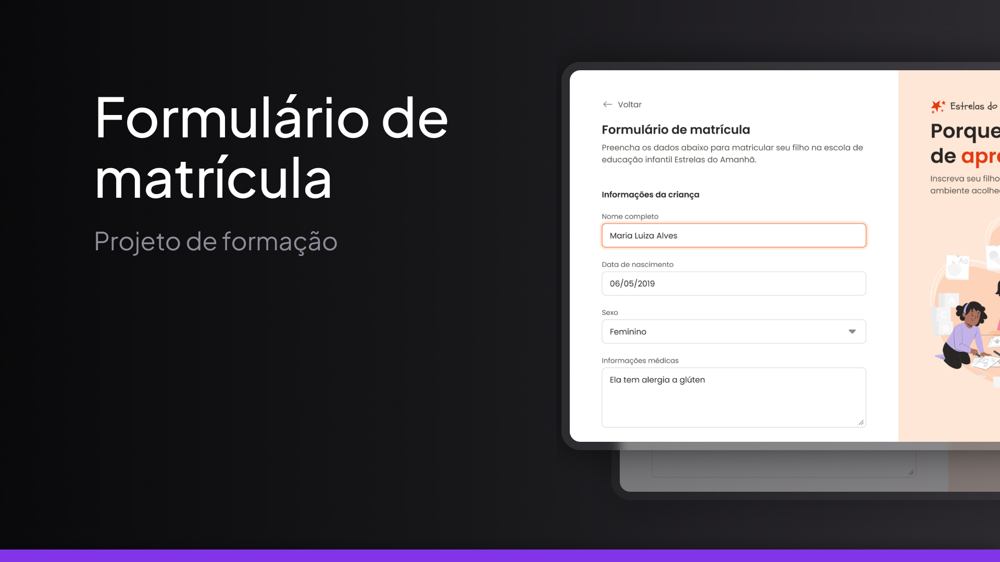

# 📝 Formulário de Matrícula

Este repositório contém o projeto de um Formulário de Matrícula, desenvolvido como parte do curso de **Formação Fullstack** da Rocketseat. A proposta foi criar uma página funcional, com foco em acessibilidade, semântica HTML e boas práticas na construção de formulários.

<p align="center">
  
</p>

## 📋 Sobre o Projeto

O objetivo deste projeto foi construir uma página de formulário de matrícula para uma instituição fictícia de ensino, permitindo que usuários preencham dados pessoais, informações escolares e escolham o curso desejado de forma clara e objetiva.

A interface é simples, sem uso de animações ou JavaScript, com foco em estrutura limpa, responsiva e acessível para todos os dispositivos.


## 🖥️ Tecnologias Utilizadas

- **HTML5**: Estrutura semântica da página
- **CSS3**: Estilização e responsividade com media queries

## 📸 Visão Geral do Design

A proposta visual do projeto é simples e objetiva, garantindo boa legibilidade e navegação intuitiva. Foram utilizados elementos básicos de design como espaçamento adequado entre campos, fontes legíveis e layout centralizado.


## 🚀 Como Executar o Projeto

1. **Faça o clone do repositório**:

    ```bash
    git clone https://github.com/seu-usuario/projeto-formulario-matricula.git

2. **Navegue até a pasta do projeto**:
    ```bash
    cd projeto-formulario-matricula

2. **Abra o arquivo index.html em qualquer navegador web**.


## 📂 Estrutura de Arquivos
```plaintext
projeto-formulario-matricula/
│
├── assets/             # Pasta para imagens e outros recursos
│
├── styles/             # Pasta para arquivos CSS
│   ├── footer.css      # Estilos para o rodapé
│   ├── global.css      # Estilos globais
│   ├── header.css      # Estilos para o cabeçalho
│   ├── index.css       # Estilos específicos para a página principal
│   ├── main.css        # Estilos para o conteúdo principal
│   └── nav.css         # Estilos para a navegação
│
└── index.html          # Página principal do perfil
```

## 🤝 Contribuição

Este projeto foi criado como um exercício de HTML e CSS, mas se você quiser contribuir ou sugerir melhorias, sinta-se à vontade para fazer um fork e enviar um Pull Request.
