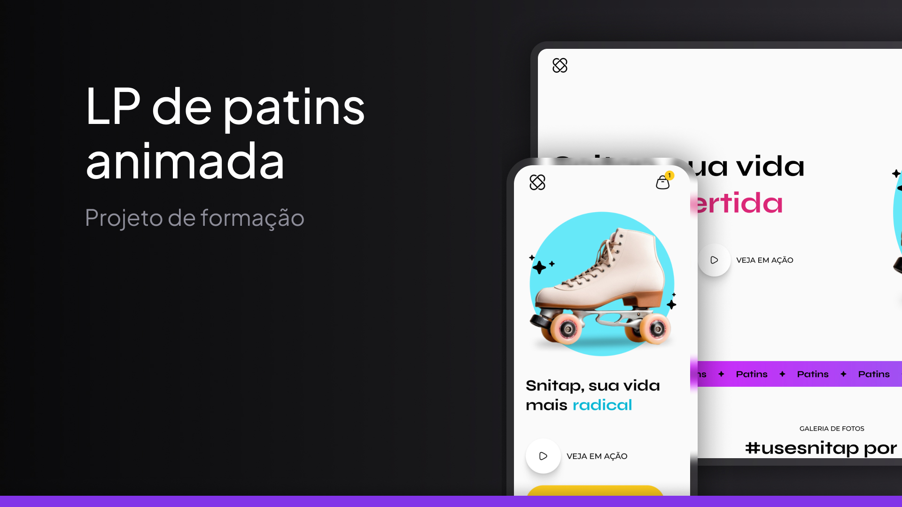

# 🛼 Snitap | Página de Venda de Patins

Este repositório contém o projeto Snitap, uma Landing Page de e-commerce desenvolvida como parte do curso de **Formação Fullstack** da Rocketseat. A proposta foi criar uma página moderna, atraente e responsiva para promover e vender patins ao público apaixonado por esportes urbanos.

<p align="center">
  
</p>

## 📋 Sobre o Projeto

Snitap é uma página fictícia de e-commerce voltada para a venda de patins. A proposta do layout é atrair o usuário com um visual ousado e dinâmico, utilizando animações e transições suaves para enriquecer a experiência de navegação.

O projeto é 100% estático, construído com HTML5 e CSS3, e foi idealizado para colocar em prática fundamentos de estruturação, responsividade e introdução à animação com CSS.

- Seção de destaque com imagem hero e chamada para ação (CTA)
- Apresentação de modelos de patins
- Lista de benefícios e diferenciais
- Galeria de produtos com efeitos visuais
- Rodapé com informações adicionais e redes sociais


## 🖥️ Tecnologias Utilizadas

- **HTML5**: Estrutura semântica da página
- **CSS3**: Estilização, responsividade, animações e transições

## 📸 Visão Geral do Design

A interface do Snitap foi projetada para ser envolvente, utilizando imagens grandes, tipografia moderna e cores chamativas para criar uma experiência de compra dinâmica e agradável. Ideal para usuários que valorizam estilo, agilidade e performance.

- Transições suaves em botões e links
- Animações de entrada de elementos ao carregar a página
- Uso de @keyframes para dar vida à interface

## 🚀 Como Executar o Projeto

1. **Faça o clone do repositório**:

    ```bash
    git clone https://github.com/seu-usuario/projeto-snitap.git

2. **Navegue até a pasta do projeto**:
    ```bash
    cd projeto-snitap

2. **Abra o arquivo index.html em qualquer navegador web**.


## 📂 Estrutura de Arquivos
```plaintext
projeto-snitap/
│
├── assets/             # Pasta para imagens e outros recursos
│
├── styles/             # Pasta para arquivos CSS
│   ├── footer.css      # Estilos para o rodapé
│   ├── global.css      # Estilos globais
│   ├── header.css      # Estilos para o cabeçalho
│   ├── index.css       # Estilos específicos para a página principal
│   ├── main.css        # Estilos para o conteúdo principal
│   └── nav.css         # Estilos para a navegação
│
└── index.html          # Página principal do perfil
```

## 🤝 Contribuição

Este projeto foi criado como um exercício de HTML e CSS, mas se você quiser contribuir ou sugerir melhorias, sinta-se à vontade para fazer um fork e enviar um Pull Request.
